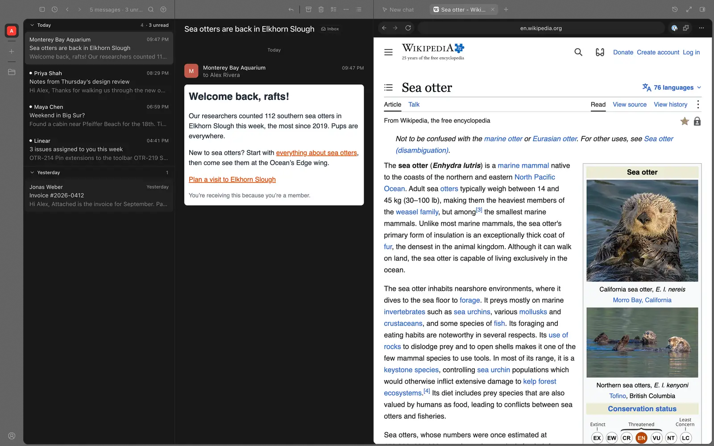
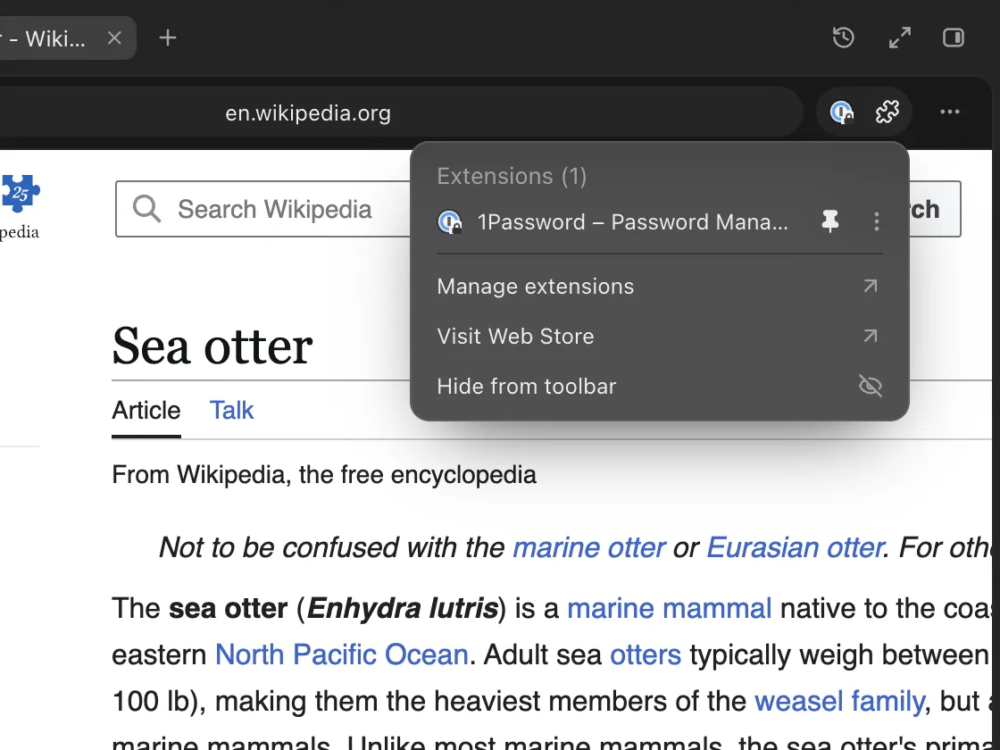
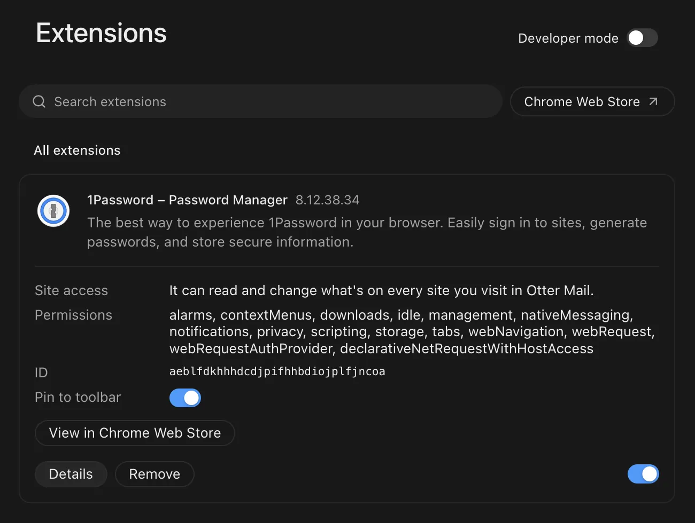

On the Mac, links from mail and chat open in a browser in the side panel, with Chrome extensions like 1Password.

## New

- Links open as tabs beside your chats, next to the conversation they came from.
- An address bar that searches, back and forward, and a start page: ⌘T, then ⌘L.
- Add extensions from the Chrome Web Store and pin them to the toolbar.
- 1Password unlocks from its button and fills in sign-in pages.
- Expand the panel to fill the window when a page needs the room.

## Improved

- Shift+↑/↓ selects several conversations in the list.
- The sidebar and message list start narrower, leaving the conversation more room.
- Otter Mail is open source, under the MIT license.
