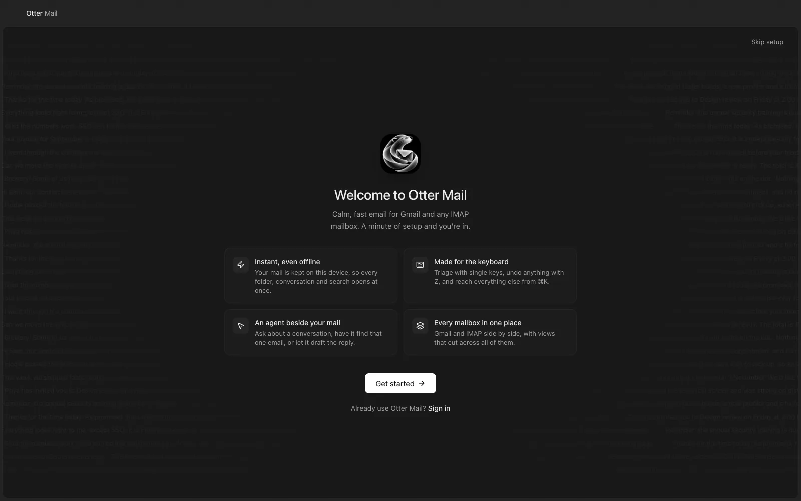
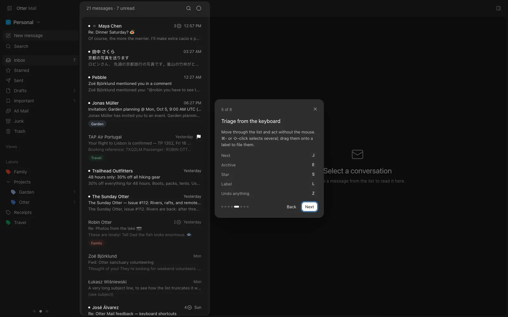

A first run that sets you up for real, and a one-minute tour of the app on your own mail.

## New

- A setup: add a mailbox, pick a look, notifications, your agent, then practice the keys.
- The keys step is a practice inbox that answers your real shortcuts, remapped ones too.
- A tour of mailboxes, search, views, the reader and the agent. Run either again from ⌘K.
- "Update Otter Mail" in ⌘K checks, downloads and restarts into the new version.

## Improved

- Hermes connects right from the setup's agent step.
- Mac releases are Apple Silicon only.
