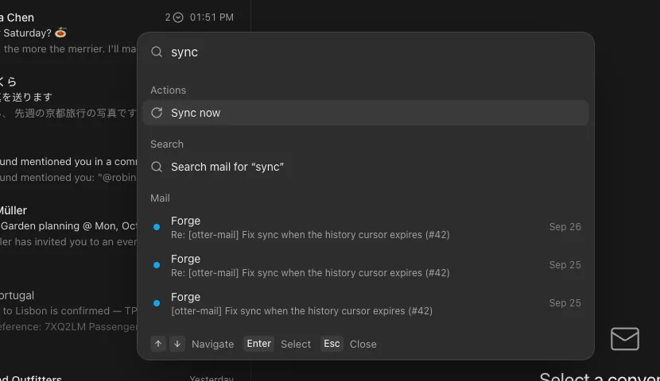

Type what you want and Enter does it: the command you name comes first, and mail search is one ↓ away.

## Improved

- ⌘K ranks what you type: "set" finds Settings, "work" your Work mailbox, "upgrade" Update Otter Mail.
- Names and searches like `from:maya` still go straight to your mail.
- Mail results arrive below the search, so nothing jumps as they load.
- The Appearance and Theme lists rank the same way: "oc" picks Ocean.
