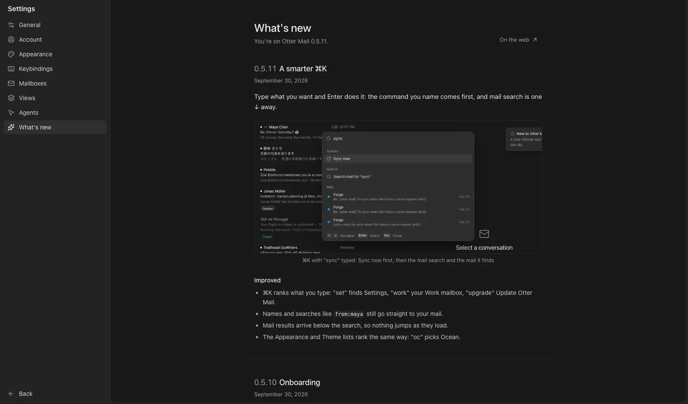

Every release now comes with a short note, in the app and on the site.

## New

- "What's new" in Settings lists every release, newest first, and works offline.
- After an update, a toast names the new version and opens its note.
- The update card links to the coming version's note before you restart.
- "What's new" in ⌘K.
- The changelog on the web at mail.otterware.app/changelog.
