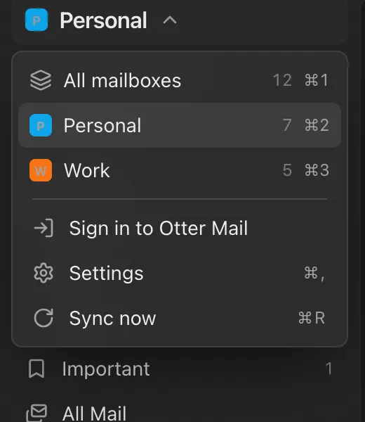
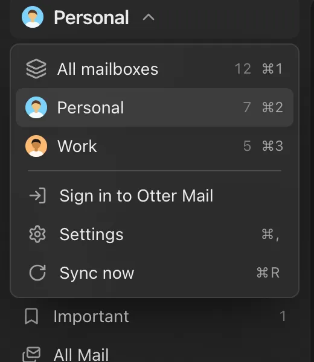

Each Gmail mailbox now shows your Google profile picture, so you can tell them apart at a glance.

## Improved

- Setup shows the pictures of the mailboxes you connect.
- A new Google photo or name shows up on its own, on every device.
- On the Mac, "Show unread count on Dock icon" in Settings → Appearance turns the badge off.
