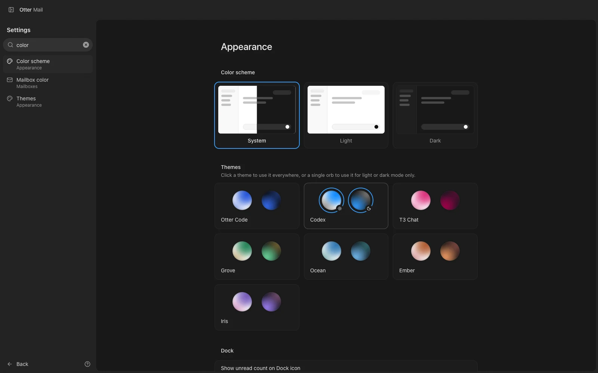

Type what you're looking for at the top of Settings, and pick it to land right on it.

## New

- Search Settings by name or by what a setting does: "sync", "dark", "signature".
- Each result shows where it lives; picking one opens it there, highlighted.
- Shortcuts are searchable too, even by their keys: "mod+b" finds Sidebar: Toggle.
- Press / in Settings to start searching.
