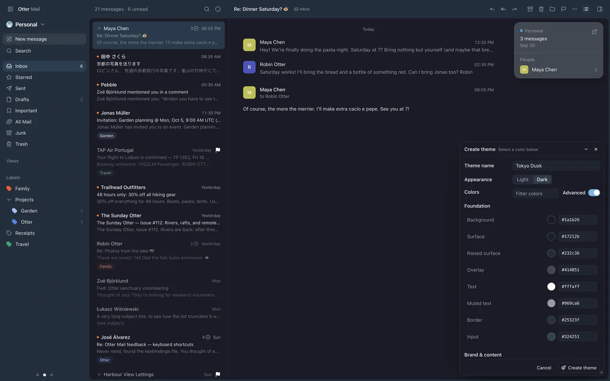
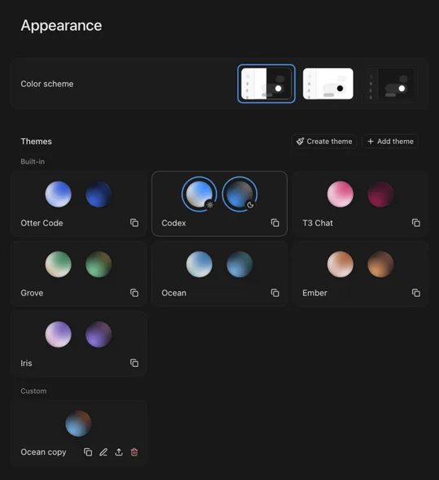

Make color themes of your own, the way T3 Code does: duplicate one and tune it while the whole app repaints as you go.

## New

- Duplicate any theme to make it yours; built-in themes stay as they are.
- The editor is T3 Code's: set two colors and the rest follows, or open Advanced for every color.
- Pick a color in the editor to dim everything except where it's used.
- "Add theme" takes T3 Code and VS Code theme files; export yours to share them.
- Your themes sync with your Otter account.

## Improved

- Appearance is more compact, with built-in and custom themes apart.
