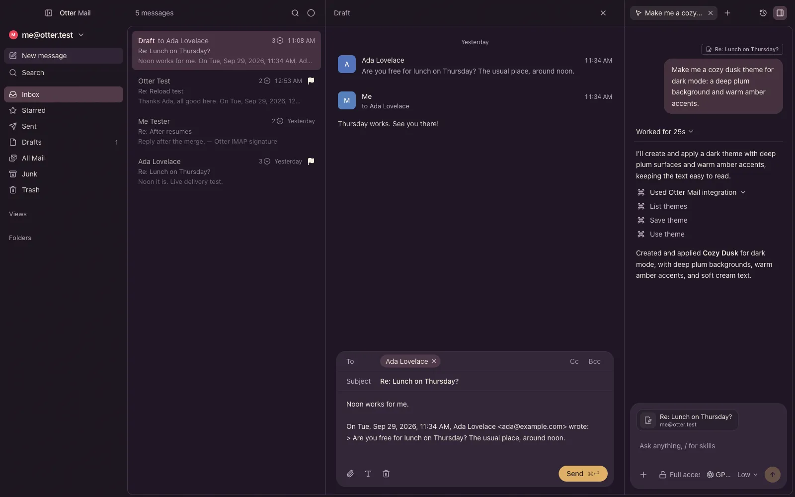

Describe a theme to the agent and it makes it and puts it on: Claude and Codex can now make, change and wear themes.

## New

- On the Mac, ask Claude or Codex for a theme in your own words; it's made and worn.
- Ask them to change the theme you're wearing: a built-in is copied first, never changed.
- They can switch themes too, for light or dark mode.
- Theme changes ask first, like mail changes, unless the chat has Full access.
