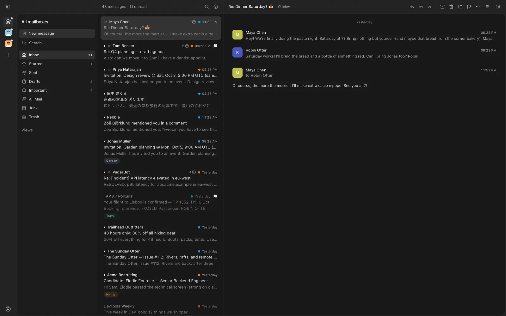
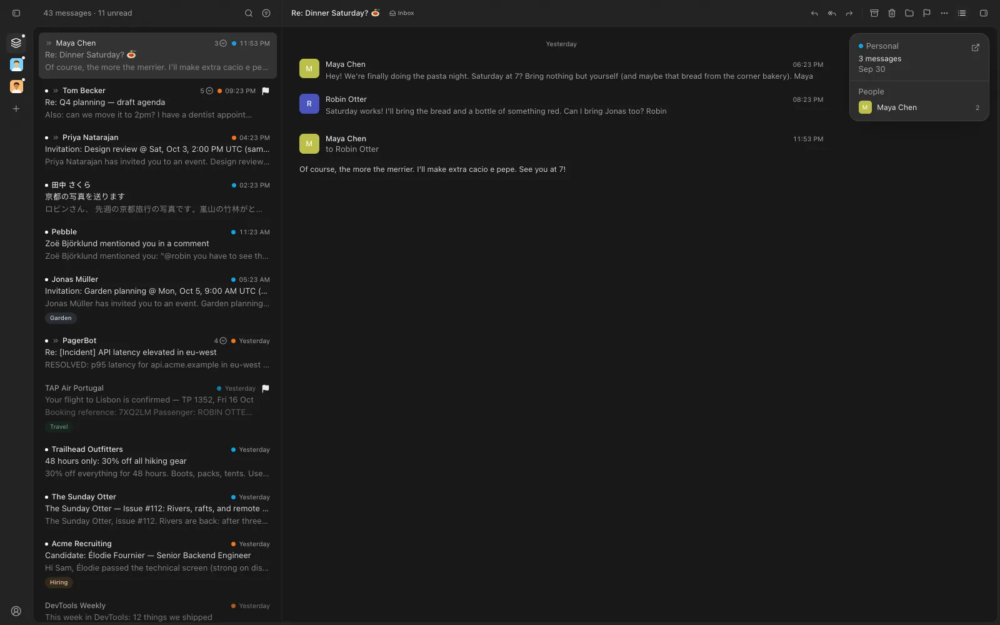

Your mailboxes now sit in a slim rail down the left edge, so switching and spotting new mail never needs the sidebar.

## New

- A rail of mailboxes down the left: click one to switch; a dot marks new mail.
- Add a mailbox from the rail's +; your account, Settings and feedback sit at its foot.
- Hiding the sidebar keeps the rail, so every mailbox stays one click away.
- On the Mac, the title bar and rail let the window's frosted glass through.

## Improved

- The sidebar sits inside the mail panel, with an edge that shows in every theme.
- The sidebar and agent toggles show whether their side is open.
- The unread filter wears Apple Mail's filter icon, filled while it's on.
- Mail and Settings each remember their own sidebar, open or closed.
