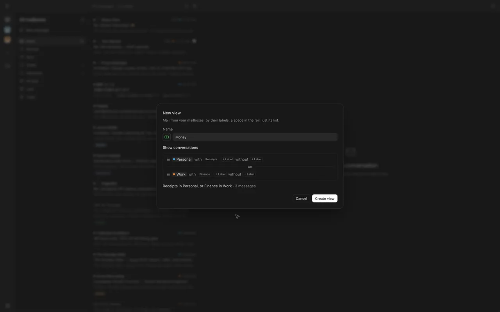
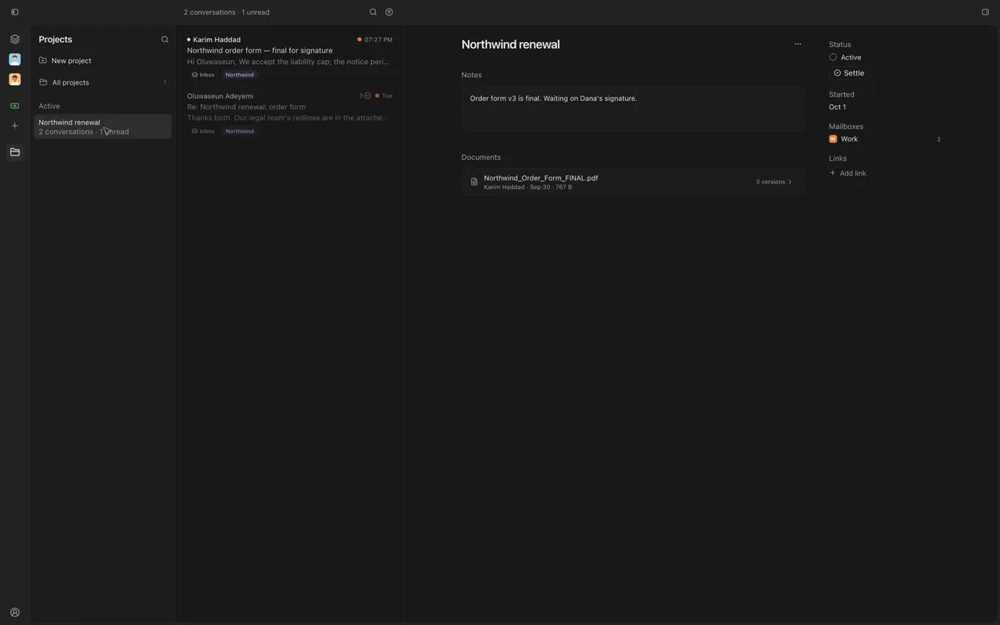
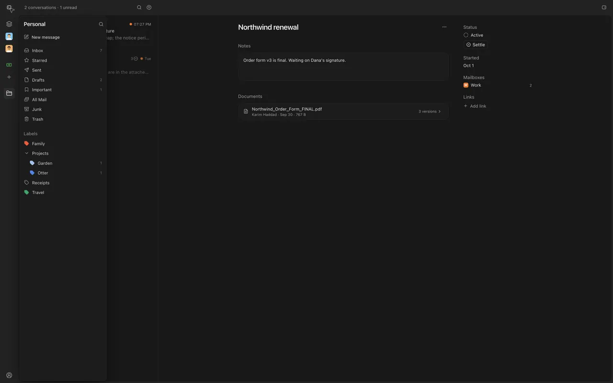

Views become spaces of their own in the rail, and Projects keep one piece of work's conversations, from any mailbox, in one place.

## New

- Projects: gather a piece of work's conversations, documents, links and notes until it's settled.
- Right-click any conversation and choose "Add to project", from any mailbox.
- Views are spaces in the rail: just their list, across every mailbox they draw on.
- Make a view with "New view" (+) in the rail: in this mailbox, with these labels, without those.
- Give a view an icon or an emoji, in a color.
- With the sidebar hidden, hover a space in the rail to peek at its sidebar.
- Your agent can start projects, add conversations to them and make views.

## Improved

- Views are made and edited where they live, no longer in Settings.
- "Show unread dots in the rail" is a setting now, off to begin with.
