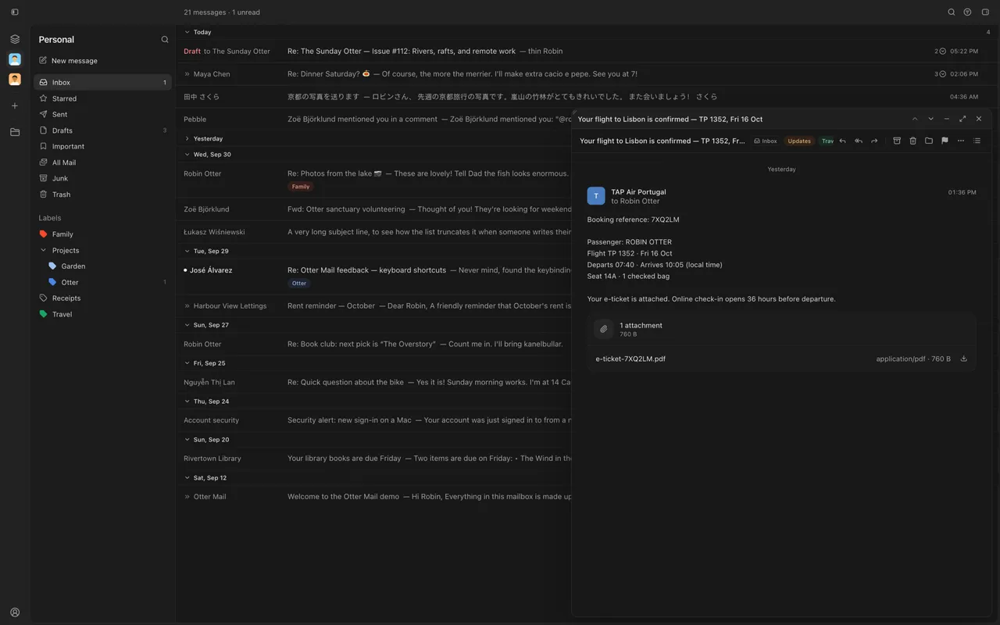

On Mac and the web, choose your inbox layout or keep a conversation floating while you browse.

## New

- Appearance offers Classic or With dividers, plus Split view, Full inbox and Floating layouts.
- Floating conversations move, snap back, resize and minimize to the bottom right.
- Day groups collapse, and read messages can have a muted background. Turn either setting off.

## Improved

- Arrows highlight rows; Enter opens them. Automatic opening is an optional setting.
- Keyboard previews wait two seconds before becoming read. Adjust the delay in Appearance.
- Buttons respond to hover immediately.

## Fixed

- Browsing past a draft keeps keyboard navigation active.
- Opening a conversation marks every message read immediately, before Gmail finishes.
